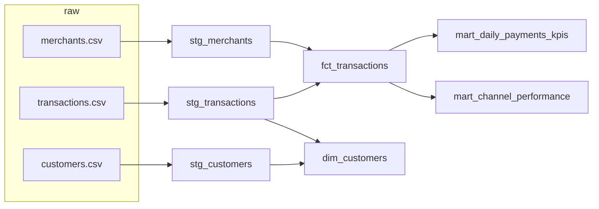

# Fintech dbt Analytics Warehouse


An analytics-engineering project: **dbt + DuckDB** models that turn raw wallet/payments extracts into tested, documented marts that a BI tool or finance team can trust.

> Data is fully synthetic and seeded (`src/gen_data.py`).

## Lineage


| Layer | Models | Materialisation | Purpose |
|---|---|---|---|
| staging | `stg_*` | view | rename, cast, 1:1 with source |
| marts | `fct_transactions`, `dim_customers` | table | clean grain, business entities |
| marts | `mart_daily_payments_kpis`, `mart_channel_performance` | table | KPIs for dashboards |

## What it demonstrates
- **Layered modelling** (staging -> marts), explicit grain documented per model.
- **12 data tests**: `unique`, `not_null`, `accepted_values`, `relationships` (FK integrity) plus a **singular test** (`tests/assert_no_negative_amounts.sql`).
- A reusable **Jinja macro** (`ngn_millions`) to keep metric logic DRY.
- **CI**: GitHub Actions generates data and runs `dbt build` + `dbt docs generate` on every push.

Result of `dbt build`: `PASS=20 WARN=0 ERROR=0` (8 models + 12 tests).

## Run it
```bash
pip install -r requirements.txt
python src/gen_data.py --out data/raw
dbt build --profiles-dir .
dbt docs generate --profiles-dir . && dbt docs serve --profiles-dir .
```
Query the output: `duckdb data/warehouse.duckdb "select * from mart_channel_performance order by failure_rate_pct desc"`.

## Next steps
Incremental models for `fct_transactions`, snapshots (SCD2) on `dim_customers`, source freshness checks, and a Postgres/BigQuery target.
